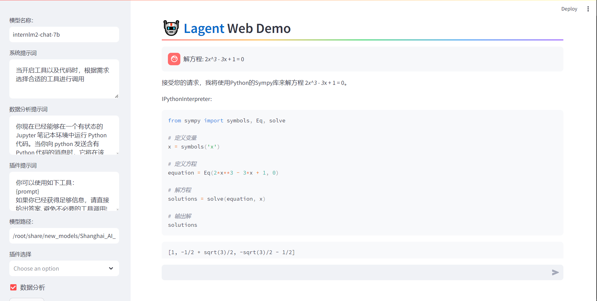

**使用 InternLM2-Chat-1.8B 模型生成 300 字的小故事**

**使用 Bajie-Chat-1.8B 模型**

**使用`huggingface_hub`包，下载InternLM2-Chat-7B 的`config.json`文件**

**完成Lagent工具调用数据分析Demo部署**

**完成浦语·灵笔2的图文创作及视觉问答部署**

- **图文创作**

  
- **视觉问答**
