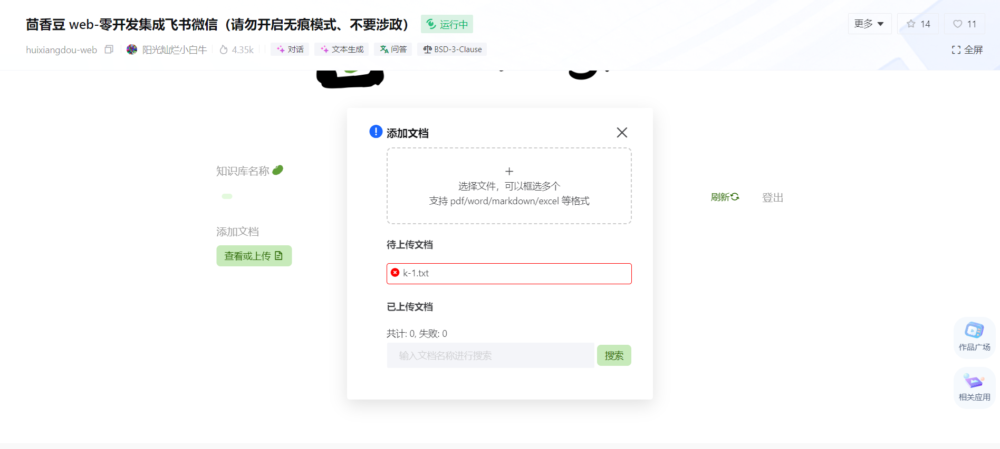
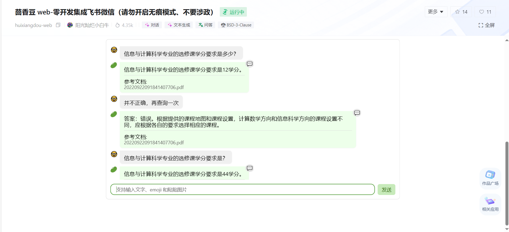
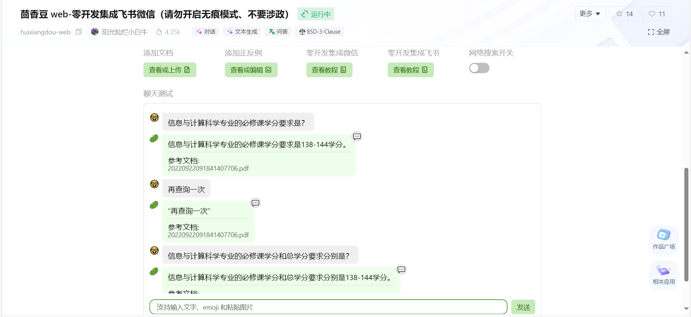
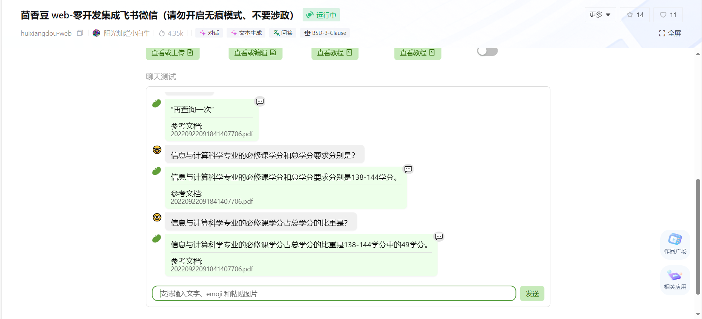
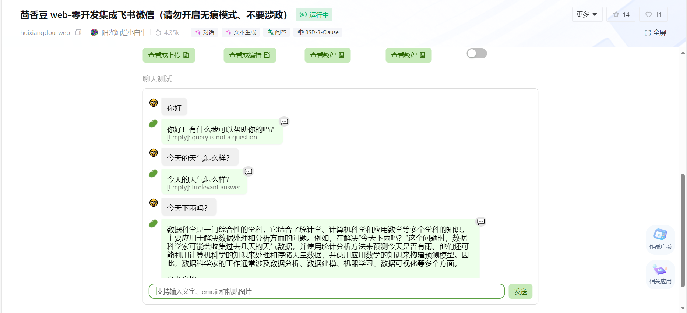
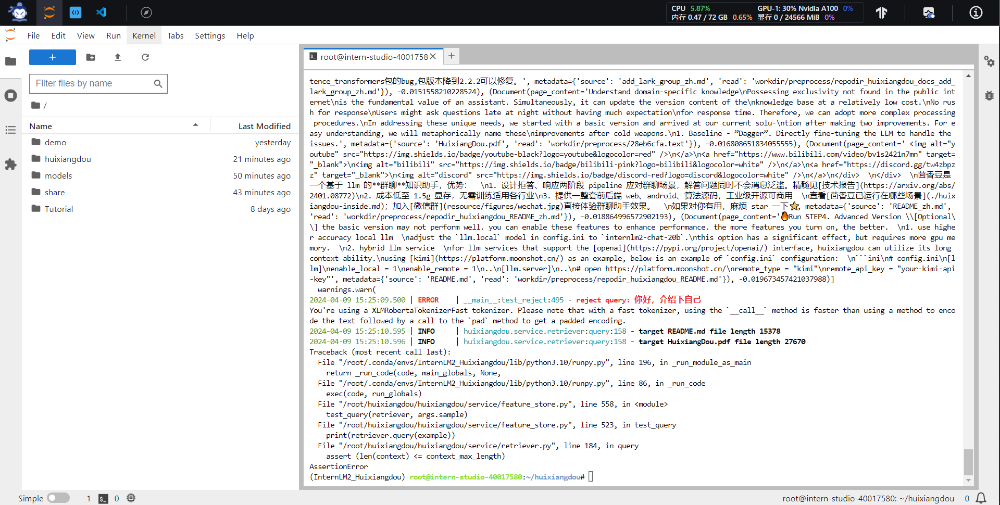
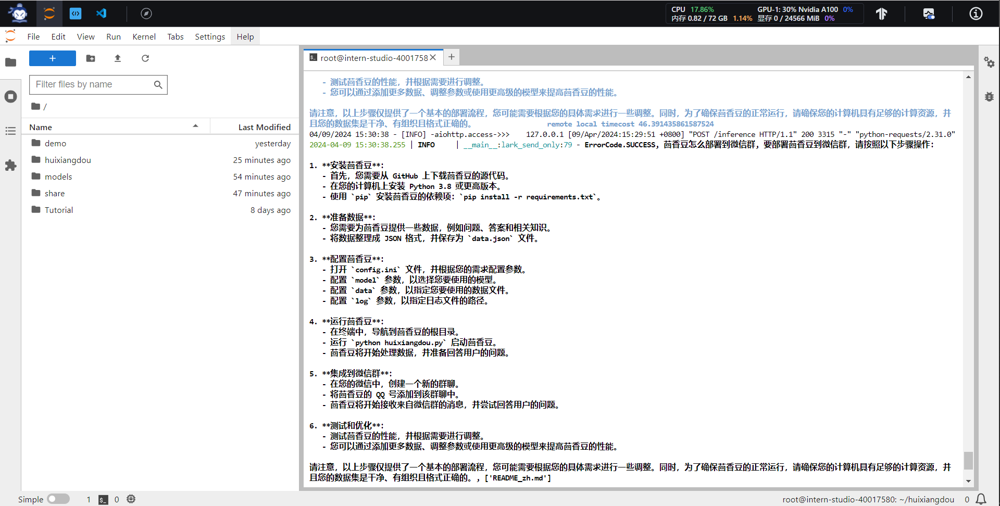

## 作业三
#### 1. 在茴香豆 Web 版中创建自己领域的知识问答助手
茴香豆是基于LLM的领域知识助手, 用于解答如微信和飞书等IM平台群聊里的问题.\
首先是创建知识库和密码:\
用户名: key-base (至少8个字符)\
进入后通过“查看或上传”可以添加文档, 但目前没有看到删除选项, 因而需要注意上传内容.\
通过"查看或编辑”可以添加正反例, 其中正例指应该予以答复的示例, 而反例指应该予以拒答的示例.\
通过实际测试, 可以知道要用好茴香豆需要对数据源进行一定加工处理制成更合适的语料库, 否则直接上传原始文件的效果可能并不理想, 此外需要注意的是茴香豆在问答中对一些上下文的理解有问题, 因而在实际应用中需要对模型作更细致的调整以满足需求.

集成微信的回调地址为:\
http://139.224.198.162:18443/api/v1/message/v1/wechat/9MLb \
具体配置过程见: https://zhuanlan.zhihu.com/p/686579577

集成飞书的配置过程见:\
https://aicarrier.feishu.cn/docx/H1AddcFCioR1DaxJklWcLxTDnEc

Chrome运行失败, 可能和某些浏览器设置有关.

换用Edge后正常.

似乎无法理解一些上下文问答.

仅在某些提问方式下能够回答正确.

设置正例后能够进行回答, 但回答内容与实际问题无关.

#### 2. 在InternLM Studio上部署茴香豆技术助手
具体细节参见:\
https://github.com/InternLM/Tutorial/tree/camp2/huixiangdou#2-使用茴香豆搭建-rag-助手 \
具体理论笔记见[Note.md](./Note.md)文件\
使用Huixiangdou语料和网易BCE双语模型\
建立接受和拒答两个向量数据库\
通过将输入问题与两个数据库的问题在向量空间进行相似度比较, 判断问题是否应该回答. 对于判断需要回答的问题会调用基础模型提取关键词, 在外部知识库中检索前K相似度的chunk, 综合问题和检索到的chunk生成答案.

