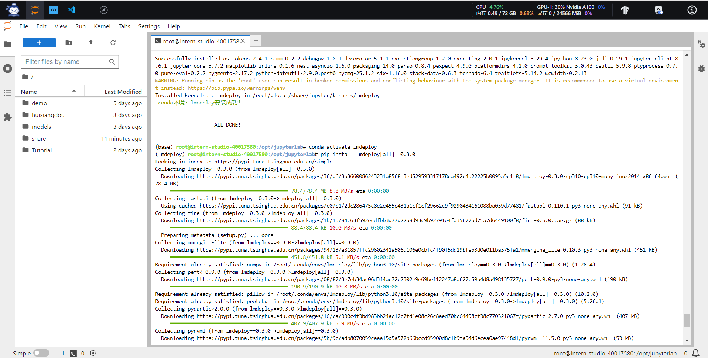
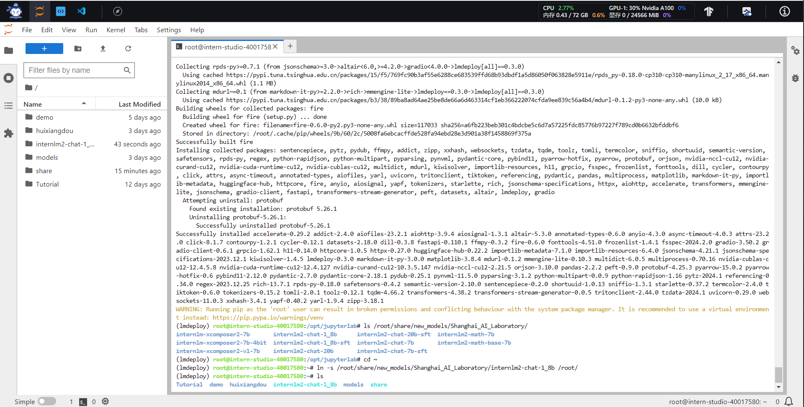
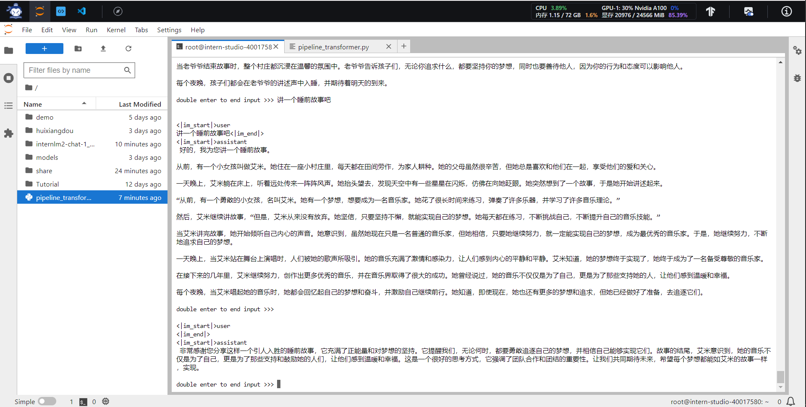
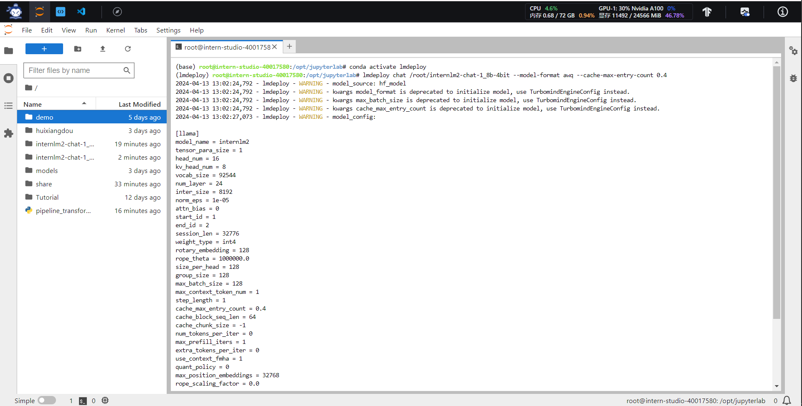
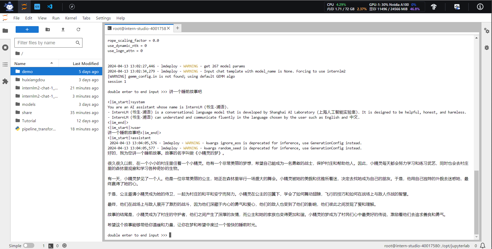
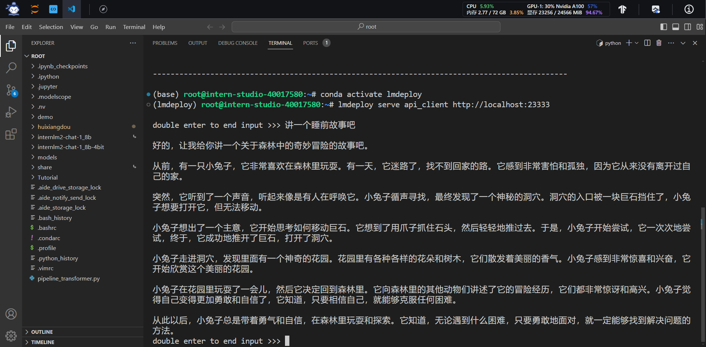
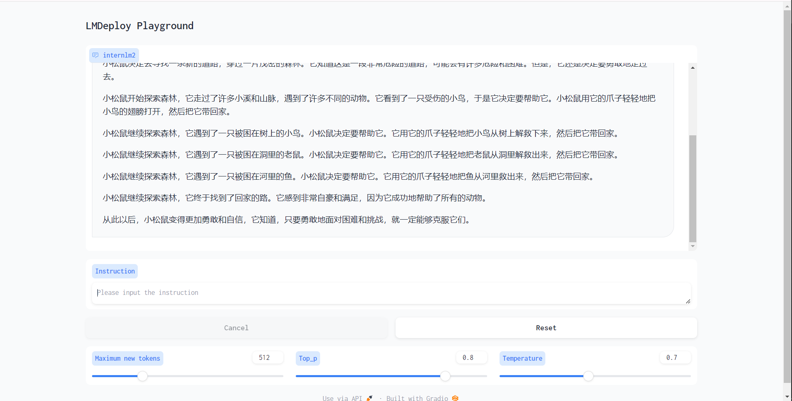
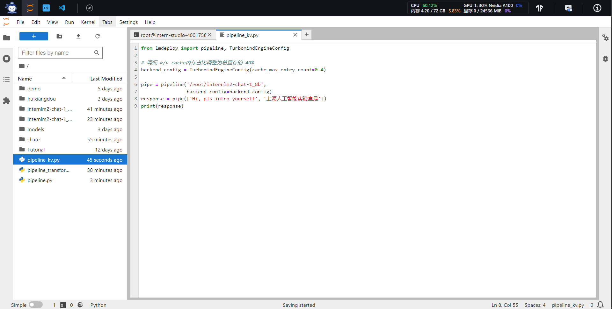
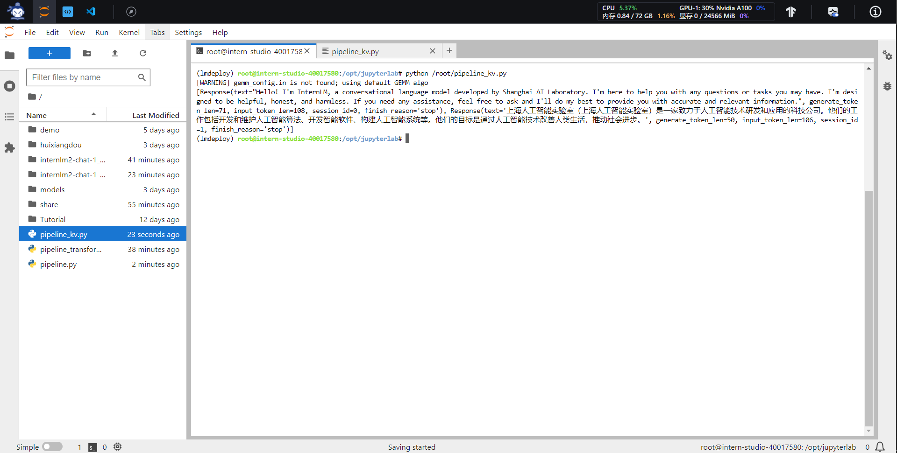
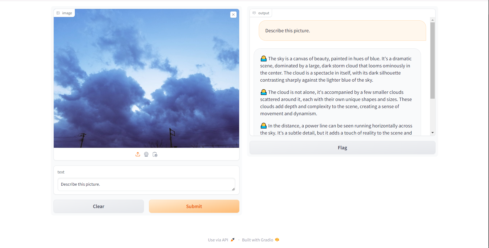

## 作业三
### 基础作业
#### 配置lmdeploy运行环境

#### 下载internlm-chat-1.8b模型

#### 以命令行方式与模型对话

### 进阶作业
#### 设置KV Cache最大占用比例为0.4，开启W4A16量化，以命令行方式与模型对话

#### 以API Server方式启动lmdeploy，开启 W4A16量化，调整KV Cache的占用比例为0.4，分别使用命令行客户端与Gradio网页客户端与模型对话

#### 使用W4A16量化，调整KV Cache的占用比例为0.4，使用Python代码集成的方式运行internlm2-chat-1.8b模型

#### 使用LMDeploy运行视觉多模态大模型llava gradio demo

#### 将LMDeploy Web Demo部署到OpenXLab